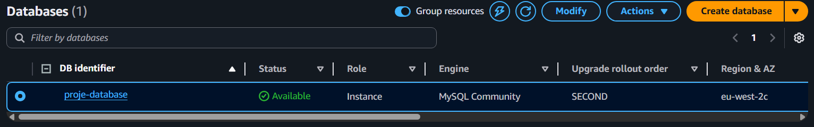
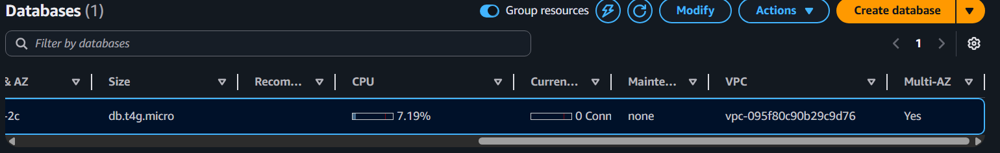
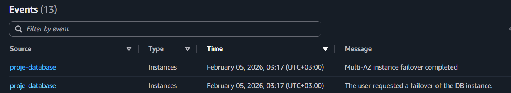
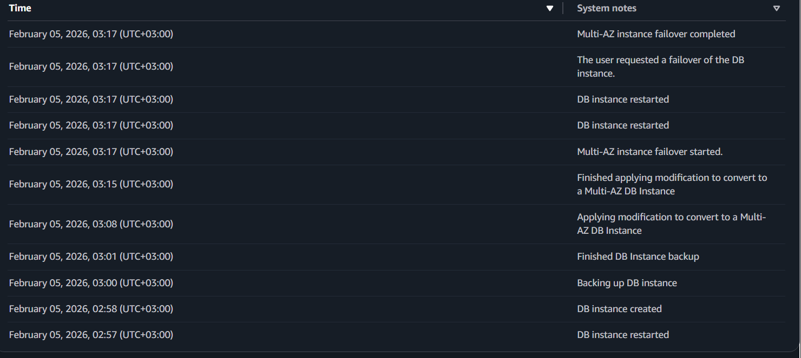
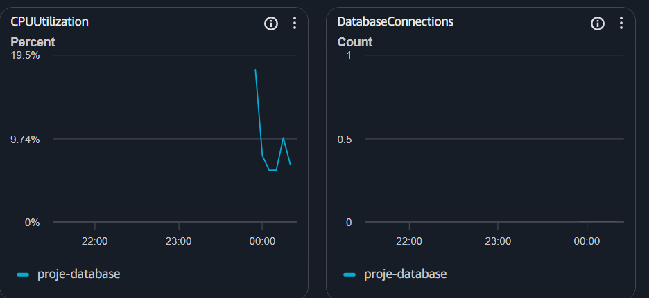

# AWS-RDS-High-Availability

## Projenin Amacı
Bu projede, AWS Management Console kullanarak bir veritabanı altyapısının felaket anında (Disaster Recovery) nasıl kesintisiz çalışmaya devam ettiğini (High Availability) simüle ettim.

## Kullanılan Teknolojiler
- **AWS RDS:** MySQL Engine
- **VPC & Networking:** Internet Gateway, Route Tables, Subnet Groups
- **Security:** Security Groups (Inbound/Outbound Rules)

## Uygulama Adımları (Konsol Üzerinden)
1. **Network Altyapısı:** Veritabanının internete çıkabilmesi için VPC'ye bir Internet Gateway bağladım ve Route Table ayarlarını güncelledim.
2. **RDS Kurulumu:** Başlangıçta Single-AZ olarak kurulan MySQL instance'ını, "Modify" seçeneği ile Multi-AZ mimarisine yükselttim.
3. **Failover Testi:** "Reboot with Failover" komutuyla ana sunucuyu manuel olarak devre dışı bıraktım.
4. **Gözlem:** AWS'nin saniyeler içinde DNS kaydını yedek (Standby) sunucuya nasıl yönlendirdiğini ve sistemin endpoint değişmeden ayakta kaldığını doğruladım.

## Sonuçlar
- **Kesinti Süresi:** Failover süreci 60 saniyenin altında, rekor bir hızla (aynı dakika içerisinde) tamamlanmıştır. (February 05, 2026, 03:17 (UTC+03:00))
- **Veri Güvenliği:** Ana sunucu düşse bile verilerin yedek sunucuda hazır olduğu doğrulandı.

